# Advanced Lane Finding

In this project, a software pipeline was written to identify the lane boundaries in a video from a front-facing camera on a car.
The full code can be found in the file "P2.ipynb".

## Field test on german highway A99 in Munich
I wanted to know if this algorithm runs on real videos taken by myself. So, what did I do? I took my wife out on the next highway from our apartment. She had to drive the car, so I was able to adjust the camera and record a video. Then I tested the algorithm on this video.
Here ist the result:
[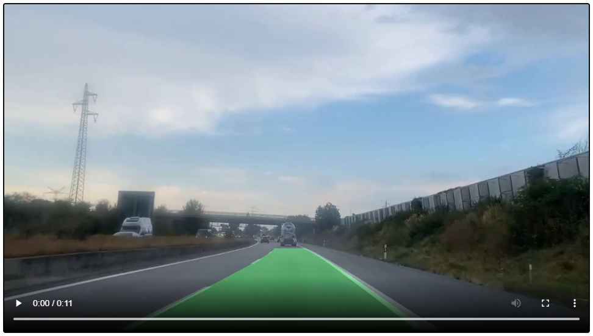](https://youtu.be/lbWOEhMHyzg)

Additionally, in this longer clip the radius of the curvature and the offset of the car with respect to the center are provided:
[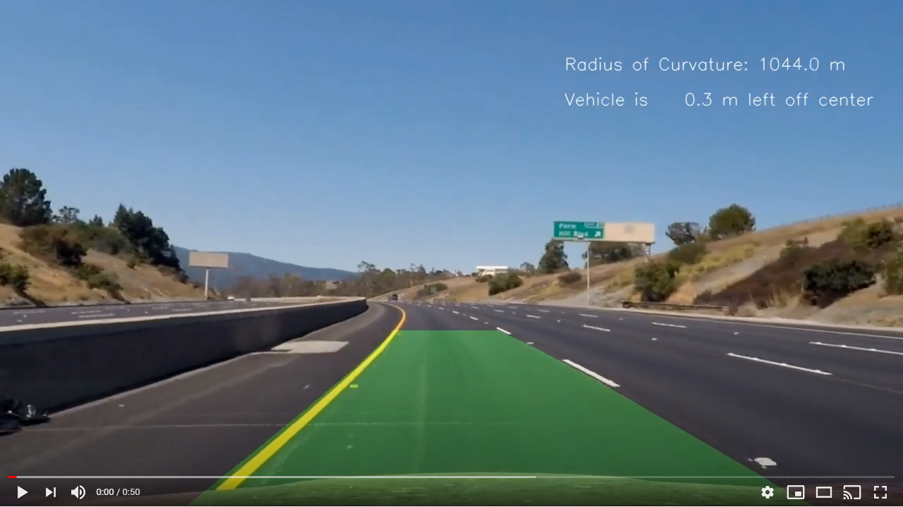](https://youtu.be/1D6195fExJs)

The steps of this project are the following:

* Compute the camera calibration matrix and distortion coefficients given a set of chessboard images.
* Apply a distortion correction to raw images.
* Use color transforms, gradients, etc., to create a thresholded binary image.
* Apply a perspective transform to rectify binary image ("birds-eye view").
* Detect lane pixels and fit a polynomial to find the lane boundary.
* Determine the curvature of the lane and vehicle position with respect to center.
* Warp the detected lane boundaries back onto the original image.
* Output visual display of the lane boundaries and numerical estimation of lane curvature and vehicle position.

The images for camera calibration are stored in the folder called `camera_cal`.  The images in `test_images` are for testing the pipeline on single frames. If you want to extract more test images from the videos, you can simply use an image writing method like `cv2.imwrite()`, i.e., you can read the video in frame by frame as usual, and for frames you want to save for later you can write to an image file.

## Pipeline in a nutshell
(for a very detailed description including how camera calibration is implemented, see the file "writeup.pdf")

## Step 1: Read in an image
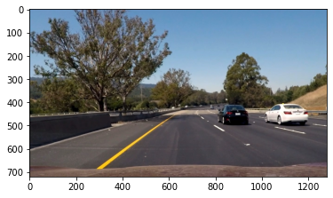

## Step 2: Distortion correction
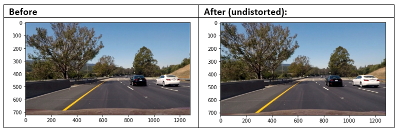

## Step 3: Thresholding
Various combinations of color and gradient thresholds were tested.
(Note: This step is visualized with “test4.jpg” instead of “test6.jpg” as for all the other steps because here you can see the advantages of s-channel when road has bad sun/shadow conditions)

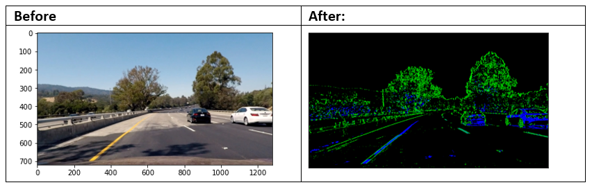

### Steps in detail:
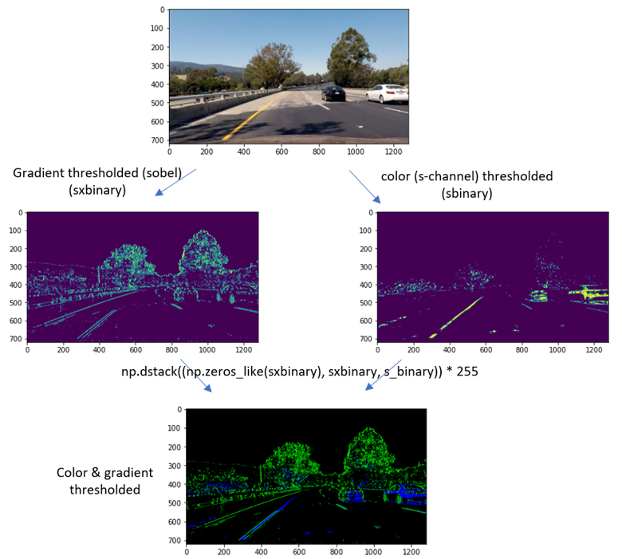

## Step 4: Perspective Transform
First, identifying four source points src (pick four points in a trapezoidal shape (similar to region masking) and after four destination points dst.
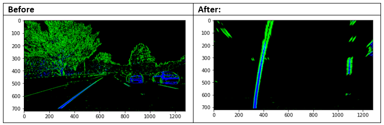

## Step 5: Grayscale
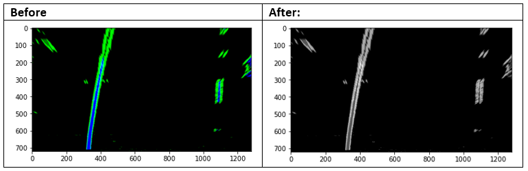

## Step 6: Detect lane pixels (sliding windows method) and fit a polynomial to find the lane boundary
Explicit Decision which pixels are part of the lines and which belong to the left respectively to the right line.
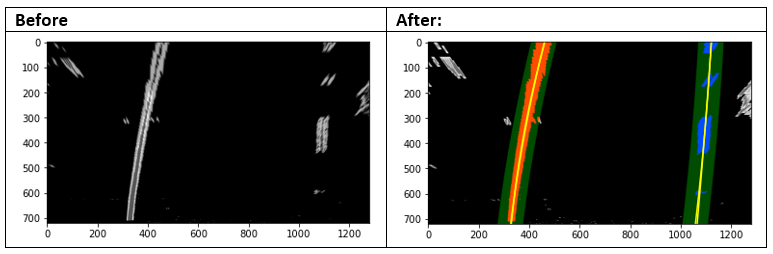

### Steps in detail:
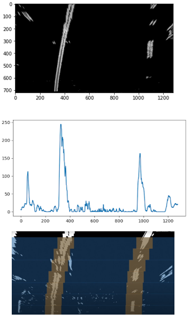

## Step 7: Drawing
This includes:
a) Draw the lines on a blank (zeroed) image
b) Warp this image back to original image space using inverse perspective Matrix (Minv)
c) Combine the result with the original image
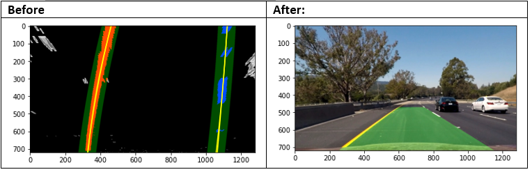
